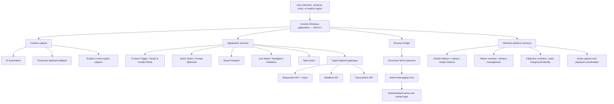

# Cursivis Next

> A shortcut-driven, context-aware Windows AI layer that turns what is already on screen into the next useful action.

**Selection = Context.**<br>
**Trigger = Intent.**<br>
**Cursivis = Action.**

[](https://www.microsoft.com/windows)
[](https://dotnet.microsoft.com/)
[](https://learn.microsoft.com/windows/apps/winui/winui3/)
[](https://platform.openai.com/)
[](https://github.com/UnknownGod2011/openai-cursivis/actions/workflows/ci.yml)
[](https://github.com/UnknownGod2011/openai-cursivis/releases/tag/v0.1.0-beta.4)
[](LICENSE)

| | |
| --- | --- |
| **Windows beta** | [Download Cursivis Next](https://github.com/UnknownGod2011/openai-cursivis/releases/download/v0.1.0-beta.4/Cursivis-Setup-0.1.0-beta.4-x64.exe) |
| **Live website** | [cursiviss.vercel.app](https://cursiviss.vercel.app) |
| **GitHub Release** | [v0.1.0-beta.4](https://github.com/UnknownGod2011/openai-cursivis/releases/tag/v0.1.0-beta.4) |
| **Source code** | [UnknownGod2011/openai-cursivis](https://github.com/UnknownGod2011/openai-cursivis) |

## The problem: AI should not make work leave its context

Conventional AI workflows begin with a small tax that compounds all day: select a paragraph, copy it, switch to a chat, reconstruct what the text belongs to, write a prompt, wait, then carry the answer back to the original application. The user becomes the integration layer between their work and the model.

Cursivis Next takes the opposite view. The active application, selected text, chosen image region, and current task are already valuable context. A global trigger should turn that context into a focused capability without forcing the user into another workspace.

It is built to disappear back into the workflow: capture context before focus moves, communicate state through lightweight overlays, preserve the original target for insertion or undo, and keep a resident set of reliable shortcuts available in the background.

## What Cursivis Next is

Cursivis Next is a Windows-first AI productivity layer built with WinUI 3, .NET 8, Windows platform services, a Chromium browser bridge, and OpenAI APIs. Its central loop is:

```text
Select → Trigger → Understand → Respond → Refine or Act
```

It supports bounded flows for text, code, images, visible interfaces, voice, browser work, and step-by-step navigation guidance. It is **not** unrestricted autonomous computer control: screen capture is explicit, browser actions are typed and policy-checked, and sensitive operations require confirmation.

## Core product flows

### Context Trigger

**Default:** `Ctrl + Alt + O`

The Context Trigger is the primary interaction. It captures selected text from a desktop or browser application, identifies the useful operation through Smart Mode, and presents the output in the Result Panel. When Smart Mode is not the right fit, Guided Mode produces context-specific options and keeps the same captured context for the next operation.

When no text is selected, the trigger opens an explicit screen-region selector. The selected region goes through the multimodal image path; an accidental click or tiny drag is not silently treated as colour detection.

The Result Panel keeps the original target and context available for **Copy**, **Refine**, **Insert / Replace**, **Undo** where supported, **More Options**, and **Take Action**. Successful generated results can also be copied automatically according to the saved behavior setting.

### Live Mode

**Default:** `Ctrl + Alt + P`

Live Mode is a focused OpenAI Realtime conversation, not a second generic chat application. At session start it captures bounded selected-text context when available. During the session it can use approved, explicit tools to refresh selected text, analyze a user-chosen screen region, start Navigation Guidance, or route into the existing safe action system.

The Live surface combines a compact circular Live orb, a deliberately faint Live-only halo, and an optional rounded transcript panel with connection/listening/thinking/speaking state, user and assistant transcripts, audio activity, and End control. The eye control hides or restores the transcript panel without ending the conversation; that preference persists across sessions and restarts. Interruption and cancellation are part of the session lifecycle.

Live Mode stores memory only through the product's explicit memory flow. It does not treat every conversation as a permanent memory.

### Prompt Optimizer

**Default:** `Ctrl + Alt + Y`

Prompt Optimizer is the default Custom Quick Task and is a first-class flow rather than a menu afterthought:

1. Select a rough, incomplete, or unclear prompt.
2. Press the Quick Task trigger.
3. Cursivis captures the prompt before its overlay changes focus.
4. The orb shows the operation state.
5. The Result Panel returns a clearer, structured, implementation-ready prompt.
6. Copy, refine, insert, replace, and undo remain available where the source application supports them.

The saved instruction preserves requirements, named entities, links, deadlines, and unresolved conflicts instead of inventing missing details. If no selection exists, Cursivis can use its compact task-input fallback. Settings **→ Quick Task** controls the saved task.

### Smart Dictation

**Default:** `Ctrl + Alt + U`

Smart Dictation acquires a managed microphone session, transcribes speech through the configured OpenAI transcription path, cleans punctuation and structure, then tries to insert into the original target. If insertion is not safe or supported, it uses a clipboard fallback rather than losing the result. Cancellation releases the active capture flow cleanly.

### Take Action

**Default:** `Ctrl + Alt + I`

Take Action is available both directly and from the Result Panel. It turns structured proposals into bounded browser-side work through the Chromium extension, native-messaging host, authenticated same-user bridge, local policy evaluation, confirmation UI, execution, and verification.

The implemented browser flow supports compatible text fields, multiple-choice controls, checkboxes, and supported dropdown interactions, including Google-Forms-like experiences where page structure is compatible. It produces a plan and reports what was verified; it does not pretend a field was filled when verification failed. Sending messages, final form submission, purchases, deletion, account changes, and other high-impact actions remain confirmation-gated.

### Navigation Guidance

Navigation Guidance is a bounded **observe → instruct → wait → verify** loop. When explicitly enabled in **Settings → Privacy & Safety**, it can inspect the configured scope, give one next step, wait for the user to act, and verify progress before continuing. The user stays in control; it is not continuous uncontrolled monitoring or autonomous desktop operation.

### Cancel and Settings

- **Cancel active work:** `Ctrl + Alt + Escape`
- **Open or restore Settings:** `Ctrl + Alt + S`

Cursivis registers shortcuts transactionally. If Windows or another program already owns a preferred chord, it reports the conflict and can persist an available fallback. **Settings → Hotkeys** always shows the authoritative configured and active mapping for the current computer; do not assume a machine-specific fallback is universal.

## Default hotkeys

| Feature | Default shortcut | Behavior |
| --- | --- | --- |
| Context Trigger | `Ctrl + Alt + O` | Capture selected text or open explicit region capture when nothing is selected. |
| Live Mode | `Ctrl + Alt + P` | Start or stop the focused Realtime conversation. |
| Take Action | `Ctrl + Alt + I` | Open the existing safe action flow. |
| Smart Dictation | `Ctrl + Alt + U` | Start managed dictation and attempt insertion. |
| Prompt Optimizer / Custom Quick Task | `Ctrl + Alt + Y` | Run the saved Quick Task; Prompt Optimizer is the default. |
| Cancel | `Ctrl + Alt + Escape` | Cancel the current active Cursivis operation. |
| Open Settings | `Ctrl + Alt + S` | Open or restore the resident Settings window. |

> Cursivis detects conflicts, displays configured versus active shortcuts, and may persist an available fallback. **Settings → Hotkeys** is the source of truth on each PC.

## Visual interaction model

The UI is intentionally small and transient:

- **Context Orb** — compact status and drag surface close to the active work.
- **Live-only halo** — a faint, compact indication reserved for Live Mode; ordinary modes do not pulse or glow.
- **Live transcript panel** — optional, persisted, rounded, draggable, and independent from the Live session itself.
- **Circular cancel control** — immediate cancellation without a normal application title bar.
- **Guided Mode chips** — context-specific operations around the orb, including Custom Task.
- **Result Panel** — rounded, draggable, resizable output surface with result actions and persistent position/size.
- **Region selector** — explicit screen/image capture without an unintended colour-only result.
- **Navigation Guidance** — focused observation and next-step feedback when the user has enabled it.

Native overlay presentation uses custom regions, DPI-aware sizing, monitor-work-area clamping, and position persistence to keep surfaces near the workflow rather than behaving like conventional dialogs.

## Architecture



### Domain layer — `src/Cursivis.Domain`

The domain layer defines typed settings, interaction state and operation identifiers, context fingerprints and target identities, model descriptors, Quick Task definitions, action contracts, risk levels, and safety decisions. It has no dependency on WinUI, Win32, browser APIs, storage implementation, or OpenAI SDK types.

### Application layer — `src/Cursivis.Application`

The application layer orchestrates Context Trigger, Smart and Guided execution, Quick Tasks, Smart Dictation, Live Mode, Navigation Guidance, result presentation, cancellation, and Take Action. It uses operation IDs and a single interaction state model so stale asynchronous work cannot overwrite a newer operation.

### Infrastructure — `src/Cursivis.Infrastructure.*`

- **OpenAI** contains typed Responses, Realtime, and transcription gateways, structured-output handling, model validation, retry classification, and user-facing failure classification.
- **Storage** provides versioned settings, atomic persistence, recovery/migration support, local memories, and Windows current-user secret storage.
- **BrowserBridge** implements typed contracts for the native host, authenticated bridge, proposals, confirmations, browser execution, and verification.

### Windows platform layer — `apps/windows/Cursivis.Windows.Platform`

This layer owns UI Automation selection reading, protected clipboard capture, foreground-window identity, insertion and undo, global hotkeys, audio capture/realtime session support, startup registration, native overlays, pointer monitoring, screen capture, and non-client window behavior.

### WinUI application — `apps/windows/Cursivis.Windows.App`

The WinUI composition root owns resident runtime lifecycle, Settings/onboarding, Context Orb, Result Panel, Live overlay, region selector, action-plan review, theme resources, and runtime wiring. Native global hotkey operations are dispatched to their owning WinUI window thread, avoiding the thread-affinity failure mode of `RegisterHotKey` / `UnregisterHotKey`.

### Browser layer — `extensions/chromium` and `apps/windows/Cursivis.Windows.NativeHost`

The Manifest V3 extension requests site access explicitly, communicates through Chromium Native Messaging, and connects to a same-user authenticated bridge. The native host carries no OpenAI credential, exposes no generic command shell, and is allowlisted to the stable extension identity.

## Repository structure

```text
apps/
  windows/
    Cursivis.Windows.App/           WinUI 3 application, Settings, overlays, controllers
    Cursivis.Windows.Platform/      Win32/Windows services and platform adapters
    Cursivis.Windows.NativeHost/    Chromium Native Messaging host
src/
  Cursivis.Domain/                  Typed domain state, settings, models, Quick Tasks, actions
  Cursivis.Application/             Use-case orchestration and stateful workflows
  Cursivis.Contracts/               Browser/OpenAI transport contracts
  Cursivis.Infrastructure.OpenAI/   Typed OpenAI Responses, Realtime, transcription gateways
  Cursivis.Infrastructure.Storage/  Local persistence and protected credential storage
  Cursivis.Infrastructure.BrowserBridge/  Authenticated browser bridge implementation
tests/
  Cursivis.UnitTests/               Domain/application/unit coverage
  Cursivis.IntegrationTests/        Deterministic gateway, bridge, storage, Windows integration coverage
extensions/
  chromium/                         Manifest V3 browser extension
installer/                          Inno Setup script and installer notes
website/                            Next.js public download site
schemas/                            Versioned JSON schemas for structured contracts
docs/                               Product, architecture, safety, model, and build notes
scripts/                            Release build, secret scan, and extension verification
```

Useful supporting documents include [product requirements](docs/product-requirements.md), [action safety policy](docs/action-safety-policy.md), [model strategy](docs/model-strategy.md), [browser extension notes](extensions/chromium/README.md), [installer notes](installer/README.md), and the [Build with Codex record](docs/BUILD_WITH_CODEX.md).

## How selected context is captured

Cross-application selection capture is a desktop engineering problem, not a simple `Ctrl+C`. The active control may expose UI Automation selection differently across Win32, WPF, WinUI, Chromium, Electron, rich-text, and PDF applications; moving focus at the wrong moment can destroy the selection.

Cursivis captures target identity at trigger time and uses layered capture:

1. It prefers trustworthy UI Automation selection from the focused control.
2. If that is unavailable or untrustworthy, it uses a protected clipboard-copy fallback directed only at the original foreground target.
3. The fallback snapshots supported clipboard formats, observes the sequence change, reads the temporary selection, and restores only when it can prove a user change has not intervened.
4. Browser safeguards reject URL-like omnibox/browser-chrome selections when a reliable visible-selection result disagrees.
5. With no valid text selection, the Context Trigger switches to explicit region capture rather than inventing context from a title or URL.

The resulting context keeps the original target identity for insertion, replacement, and undo when the target supports those operations. Diagnostic paths are designed not to emit raw private selected content by default.

## OpenAI integration

Cursivis is OpenAI-first and keeps provider SDK types behind typed interfaces:

| Capability | Product flows |
| --- | --- |
| **Responses API** | Smart Mode decisions and execution, Guided Mode, Prompt Optimizer, Quick Tasks, result refinement, multimodal region analysis, and structured action planning. |
| **Vision input** | Explicit screen-region/image analysis in Context Trigger and Live tool flows. |
| **Realtime API** | Duplex Live Mode conversation, interruption, transcript events, and narrow typed tool calls. Ordinary text/image work does not create a Realtime session. |
| **Transcription API** | Smart Dictation and bounded transcription work. |
| **Structured tools** | Narrow Live capabilities such as fresh selected-text lookup, explicit region analysis, Navigation Guidance, and safe action routing; arguments are validated locally. |

The user supplies an OpenAI API key in Settings. The installed product never requires the repository `.env`; `.env` is an ignored local development input for explicitly enabled development checks only.

## Safety and privacy

Safety is part of the product boundary, not an afterthought:

- The API key is held in Windows user-level protected storage; it is not sent to the website or browser extension.
- Screen or image capture is explicit. Navigation Guidance additionally requires a privacy setting.
- Browser messages, model output, action plans, and tool arguments are typed and validated before execution.
- Low-risk actions can be proposed or executed within policy; sensitive operations require fresh user confirmation.
- Settings and approved memories are local. Full conversations are not automatically stored as memories.
- Cursivis uses bounded, cancellable workflows and exposes a global Cancel shortcut.
- Browser/native-host communication uses an extension allowlist, typed envelopes, and an authenticated same-user bridge rather than a fixed unauthenticated localhost port.
- Diagnostics are designed to redact or avoid raw user context by default.

See the detailed [Action Safety Policy](docs/action-safety-policy.md) for risk tiers and confirmation behavior.

## Install Cursivis Next

**Requirements:** Windows 10 version 2004 (build 19041) or later, Windows 11, x64 hardware, and your own OpenAI API key. macOS is **Coming Soon**.

1. Visit [cursiviss.vercel.app](https://cursiviss.vercel.app).
2. Click **Download for Windows**.
3. Run [`Cursivis-Setup-0.1.0-beta.4-x64.exe`](https://github.com/UnknownGod2011/openai-cursivis/releases/download/v0.1.0-beta.4/Cursivis-Setup-0.1.0-beta.4-x64.exe).
4. Approve the normal Windows installer prompts.
5. If SmartScreen shows **Unknown Publisher**, remember that this beta is not yet code-signed. Download only from the [official GitHub Release](https://github.com/UnknownGod2011/openai-cursivis/releases/tag/v0.1.0-beta.4) and verify the checksum before overriding a warning.
6. Open **Cursivis Next** from Windows Search or the Start Menu.
7. Enter and test **your own** OpenAI API key in Settings.
8. Open **Settings → Hotkeys** to confirm the active mappings on your computer.
9. Enable launch at sign-in if you want Cursivis available after Windows sign-in.

**Release checksum:** [`Cursivis-Setup-0.1.0-beta.4-x64.exe.sha256`](https://github.com/UnknownGod2011/openai-cursivis/releases/download/v0.1.0-beta.4/Cursivis-Setup-0.1.0-beta.4-x64.exe.sha256)
**SHA-256:** `af39bd3ce6d61570df79c47662dd53188c825799ee12ed9b377cc117b9b8ec41`

The per-user installer installs the self-contained app, native browser host, unpacked browser-extension files, Start Menu shortcut, optional desktop shortcut, optional startup entry, and Chrome/Edge native-host registration. The extension itself remains an explicit browser installation step; setup does not bypass browser extension protections.

## Set up a development computer

### Prerequisites

- Windows 10 version 2004+ or Windows 11 on x64.
- Git.
- [.NET SDK 8.0.423](global.json) (or the configured compatible patch).
- Visual Studio 2022 with the .NET desktop development workload and a Windows 10/11 SDK is recommended for WinUI development; the documented build route uses the .NET CLI.
- Node.js **22.13.0 or newer** for `website/`.
- [Inno Setup 6](https://jrsoftware.org/isinfo.php) to build the installer. The release script looks in the standard per-user and Program Files locations.
- A Chromium browser for extension testing. `gh` and Vercel CLI are optional but useful for release/deployment work.

### Clone, restore, build, test, and run

```powershell
git clone https://github.com/UnknownGod2011/openai-cursivis.git
cd openai-cursivis
git switch main

# Restore exactly the locked dependency graph.
dotnet restore Cursivis.sln --locked-mode -r win-x64 -p:Platform=x64

# Build the self-contained x64 Release solution.
dotnet build Cursivis.sln -c Release -p:Platform=x64 --no-restore

# Run the two deterministic suites separately.
dotnet test tests/Cursivis.UnitTests/Cursivis.UnitTests.csproj -c Release -p:Platform=x64 --no-build --no-restore
dotnet test tests/Cursivis.IntegrationTests/Cursivis.IntegrationTests.csproj -c Release -p:Platform=x64 --no-build --no-restore

# Run the current Release app after the build.
dotnet run --project apps/windows/Cursivis.Windows.App/Cursivis.Windows.App.csproj -c Release -p:Platform=x64 --no-build
```

Do not commit `.env`, API keys, user settings, transcripts, screenshots, generated output, or machine-specific data. Copy `.env.example` only for local development inputs, keep it local, and prefer entering a personal key through the application Settings flow for normal product use.

### Website

```powershell
cd website
npm ci --ignore-scripts
npm test
npm run lint
```

The site is a Next.js application. Its production download URL is intentionally versioned and points directly to the GitHub Release asset; application binaries are not stored in Vercel Blob.

### Extension and native host

```powershell
# From the repository root: validate the shipped extension sources.
.\scripts\verify-extension.ps1
```

For a development browser test, load `extensions/chromium/` as an unpacked extension through Chromium's extensions page, then use the app's Browser settings to verify bridge status. Native Messaging requires the native host and manifest generated by the installer/release flow; see [`extensions/chromium/README.md`](extensions/chromium/README.md) and [`installer/README.md`](installer/README.md). The extension has a stable identity and must not be edited casually when testing the installed bridge allowlist.

## Build, test, package, and deploy

### Validation

The latest verified release checkpoint included:

- a clean x64 Release solution build;
- **169** passing unit tests;
- **76** passing integration tests;
- website build, rendered-HTML test, and lint;
- native-host and Chromium extension source checks;
- secret scanning;
- installer installation checks; and
- a published-release installer download whose SHA-256 matched the locally tested asset.

Test counts are snapshots, not promises: they can legitimately change as coverage grows. CI runs on pushes to `main` and verifies secrets remain local, validates extension sources, restores locked dependencies, builds Release, runs deterministic .NET tests, builds/tests/lints the website, and audits production website dependencies.

```powershell
# Repository quality checks used by CI/release work.
.\scripts\check-secrets.ps1
.\scripts\verify-extension.ps1
git diff --check
```

### Package a Windows release

```powershell
# Requires Inno Setup 6. Produces self-contained app + native-host artifacts,
# a versioned installer, and a SHA-256 file under artifacts/release/.
.\scripts\build-release.ps1 -Version 0.1.0-beta.4
```

The release script publishes the unpackaged, self-contained `win-x64` WinUI app and native host, copies the compiled WinUI resources required by custom publish output, compiles the Inno Setup package, and writes a versioned installer plus checksum. Create a GitHub Release only from the tested commit, upload those exact assets, and verify the downloaded hash before changing the website's release URL.

### Deploy the website

From `website/`, use the authenticated Vercel deployment flow for production. Before deploying, update the exact versioned release URL in `website/app/page.tsx`, run `npm test` and `npm run lint`, and verify the public deployment points to the same tested installer. Do not place installers or API keys in Vercel environment variables, Vercel Blob, or website source.

## Built with Codex and GPT-5.6

Codex and GPT-5.6 were engineering collaborators throughout Cursivis Next's development. They helped inspect a repository-scale codebase, translate product goals into focused implementation slices, make cross-project C#/.NET/WinUI changes, and repeatedly evaluate the real build and packaging path.

Specific collaboration included:

- tracing global-hotkey thread ownership and lifecycle failures, then moving native registration work to the owning WinUI window thread;
- debugging transparent native overlay artifacts, DPI-aware clipping, non-activating drag behavior, and persistent overlay placement;
- strengthening cross-application/Chromium selection capture and guarding against browser URL/omnibox context being mistaken for page selection;
- building bounded Live Mode context and tools, including selected-text refresh and explicit screen-region analysis;
- adding and extending automated tests across state, hotkeys, storage, browser bridge, and OpenAI gateway behavior;
- executing builds, validation, installer packaging, secret scanning, CI diagnosis, release preparation, and website download-contract checks.

The human developer supplied the product vision, interaction model, priorities, UI feedback, safety boundaries, testing decisions, and acceptance criteria. Codex and GPT-5.6 accelerated implementation, debugging, testing, and iteration; generated changes were built, tested, visually inspected, and corrected against real application behavior rather than accepted blindly.

That collaboration mattered because Cursivis crosses WinUI, Win32, accessibility, audio, browser integration, OpenAI APIs, persistence, packaging, CI, and deployment. Repository-scale reasoning and repeated tool-assisted evaluation were useful precisely because the failure modes span those boundaries.

## Engineering challenges

| Challenge | Engineering response |
| --- | --- |
| Cross-application selected text | Trigger-time foreground identity, UI Automation first, protected clipboard fallback, restoration only when ownership remains provable. |
| Chromium returning browser chrome or URLs | Trust selection from the intended focused content path, cross-check with protected clipboard, and reject conflicting URL-like browser candidates. |
| Global shortcut conflicts and lifecycle | Transactional registration, persisted configured/active mappings, visible failure states, rollback, and registration on the owning WinUI thread. |
| Resident lifecycle | Single-instance coordination, background startup option, Settings restoration without treating Settings close as app shutdown. |
| Transparent overlays | Native window regions, custom chrome, DPI-aware rounded clipping, monitor clamping, non-client drag/resize behavior, and persistent placement. |
| Realtime audio and interruption | Managed audio-session ownership, bounded queues, explicit cancellation/disposal, and a narrow Realtime-only Live Mode gateway. |
| Model-directed actions | Typed action contracts, local validation, risk classification, confirmation, deterministic browser execution, and postcondition verification. |
| Unpackaged WinUI distribution | Self-contained x64 publish, inclusion of compiled WinUI resources, a per-user Inno Setup package, startup/native-host registration, and release-hash verification. |

## Release status and beta limitations

### Verified

- The `main` CI workflow is green for the documented release checkpoint.
- The source completed a clean x64 Release build with 169 unit tests and 76 integration tests passing at the latest verified checkpoint.
- The beta installer was produced, installed for validation, and its public GitHub Release download was SHA-256 verified.
- [cursiviss.vercel.app](https://cursiviss.vercel.app) is wired to the exact versioned GitHub installer asset.
- Deterministic coverage includes hotkey transaction/rollback behavior, selected-context guards, protected capture paths, Live transcript visibility preference, storage behavior, bridge contracts, and gateway failure handling.
- A controlled selected-text fixture, Context Trigger → Result Panel flow, and persisted Live transcript visibility behavior were exercised during the release pass.

### Physical/manual verification recommended

This is a Windows beta. The following depend on a particular device, account, page, audio device, or restart state and should be rechecked in the target environment:

- complete Windows restart/sign-in startup and the active fallback mapping on that computer;
- machine-specific hotkey conflicts from OEM tools or other resident software;
- microphone quality, speaker routing, interruption, and extended Live conversations on the user's real devices;
- Chrome/Edge selection behavior across different page types and accessibility trees;
- multi-monitor and unusual DPI combinations for overlays;
- site-specific Google Forms or browser automation compatibility;
- Windows SmartScreen behavior until the binary is code-signed.

Report reproducible issues with Windows version, display scaling, shortcut mapping, app/browser version, and a minimal non-sensitive reproduction path. Never include an API key or private selected text in an issue.

## Contributing

Focused contributions are welcome.

1. Open an issue that explains the user-visible behavior, expected result, and safe reproduction steps.
2. Keep changes small and preserve the Domain → Application → infrastructure/platform dependency direction.
3. Run the relevant unit/integration tests, extension validation, and secret scan before opening a PR.
4. Do not commit API keys, `.env`, user data, screenshots, generated binaries, transcripts, or machine-specific artifacts.
5. Preserve Cursivis Next's separate storage, installer, startup, and browser native-host identity; do not regress compatibility with an older Cursivis installation.
6. Maintain the existing safety boundaries: explicit capture, typed contracts, validation, cancellation, and confirmation for high-impact actions.

## License

[MIT](LICENSE) © 2026 UnknownGod2011.

---

> The cursor should not merely point at work.<br>
> The selection should become context.<br>
> The trigger should become intent.<br>
> **Cursivis should become the beginning of action.**
